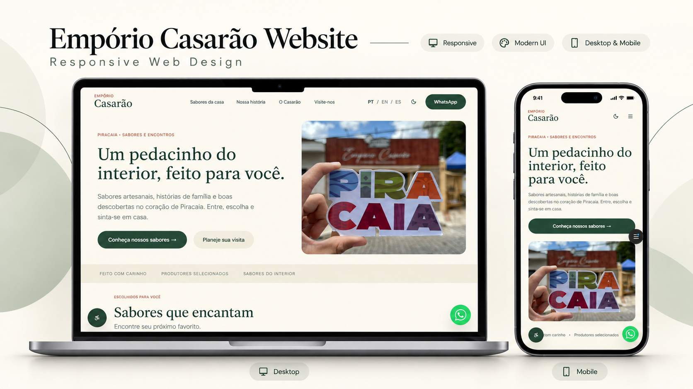

<div align="center">



# Empório Casarão

**Um pedacinho do interior, feito para você.**

Site do [Empório Casarão](https://emporiocasarao.com.br), empório de produtos artesanais no centro de Piracaia (SP).

[](https://emporiocasarao.com.br)
[](https://github.com/felipengr/emporio-casarao-v2/tags)


</div>

---

## ✨ Destaques

| | |
| --- | --- |
| 🌗 **Modo claro e noturno** | Creme e verde-mata de dia; verde profundo e pêssego à noite. |
| 🌎 **Três idiomas** | Português, inglês e espanhol, trocados na hora pelo cabeçalho. |
| 🛍️ **Vitrine por categoria** | Doces, massas e pães, café da manhã e queijos, em abas. Cada produto abre o WhatsApp com a mensagem pronta. |
| 📸 **Galeria do Instagram** | Mostra os posts mais recentes do perfil (via [Behold](https://behold.so)), com fotos locais como reserva. |
| ♿ **Acessibilidade** | Widget com ajuste de fonte, alto contraste e leitura da página em voz alta. |
| 🔎 **SEO** | Metadados, dados estruturados (`LocalBusiness`), sitemap e `robots.txt`. |
| 📈 **Métricas** | Google Analytics 4 e Tag Manager, com eventos de clique no WhatsApp, Instagram e rotas. |
| 🏷️ **Versão automática** | Cada merge na `main` sobe a versão do `package.json` e cria a tag no GitHub. |

## 🎨 Identidade visual

| | Claro | Noturno |
| --- | --- | --- |
| Fundo |  `#FAF7EF` |  `#14251F` |
| Texto |  `#213E30` |  `#F5EFE3` |
| Botões |  `#294E3A` |  `#DDA17C` |
| Superfícies |  `#EFEBDD` |  `#20362D` |
| Destaques |  `#9B472F` |  `#E8AD88` |

Títulos em **Source Serif 4** e texto em **Geist**. As cores ficam em variáveis no [`globals.css`](src/app/globals.css), e os layouts de referência estão em [`docs/layout/`](docs/layout).

## 🚀 Rodando localmente

Requer **Node 20+** e **Yarn 1**.

```bash
git clone https://github.com/felipengr/emporio-casarao-v2.git
cd emporio-casarao-v2
yarn install
cp .env.example .env.local   # opcional: feed do Instagram
yarn dev
```

Abra [http://localhost:3000](http://localhost:3000).

| Comando | O que faz |
| --- | --- |
| `yarn dev` | Servidor de desenvolvimento (Turbopack) |
| `yarn build` | Build de produção |
| `yarn start` | Sobe o build de produção |
| `yarn lint` | Checagem com Biome |
| `yarn format` | Formata o código com Biome |

### Variáveis de ambiente

| Variável | Obrigatória | Para que serve |
| --- | --- | --- |
| `BEHOLD_FEED_ID` | Não | ID do feed da Behold que alimenta a galeria. Sem ela, a galeria usa as fotos de `public/images/galeria/`. |

## 🗂️ Estrutura

```
src/
├── app/                  # Layout raiz, página, loading, 404 e sitemap
├── components/           # Seções da página (Hero, Produtos, Sobre, Galeria, Contato…)
│   ├── skeletons/        # Esqueletos de carregamento
│   └── ui/               # Componentes base (shadcn/ui)
└── lib/
    ├── site-content.ts   # Dados do site: contato, produtos, imagens
    ├── i18n/             # Textos em PT, EN e ES
    └── instagram.ts      # Integração com o feed do Instagram
docs/                     # Mockup e layouts de referência (não vão para o site)
public/images/            # Imagens publicadas
```

## ✏️ Editando o conteúdo

- **Contato, endereço e redes:** `siteConfig` em [`src/lib/site-content.ts`](src/lib/site-content.ts).
- **Textos:** [`src/lib/i18n/translations.ts`](src/lib/i18n/translations.ts). O TypeScript avisa se faltar alguma tradução em inglês ou espanhol.
- **Novo produto:**
  1. Salve a foto em `public/images/produtos/` (formato paisagem, ~1200×735, JPG).
  2. Adicione `{ id, category, image }` em `produtosMedia`.
  3. Adicione o nome e a descrição em `produtos.items`, nos três idiomas.

## 🔄 Fluxo de trabalho

1. Crie uma branch a partir da `main` e abra um Pull Request.
2. A Vercel gera um preview do PR.
3. Ao mergear, a versão sobe automaticamente conforme a mensagem dos commits:

| Commit | Versão |
| --- | --- |
| `feat!: …` ou `BREAKING CHANGE` | major (`1.0.0`) |
| `feat: …` | minor (`0.5.0`) |
| qualquer outro | patch (`0.4.2`) |

4. A Vercel publica a `main` em produção.

---

<div align="center">

Feito com carinho em Piracaia · Desenvolvido por [Felipe Nogueira](https://nogueiradev.com.br)

</div>
